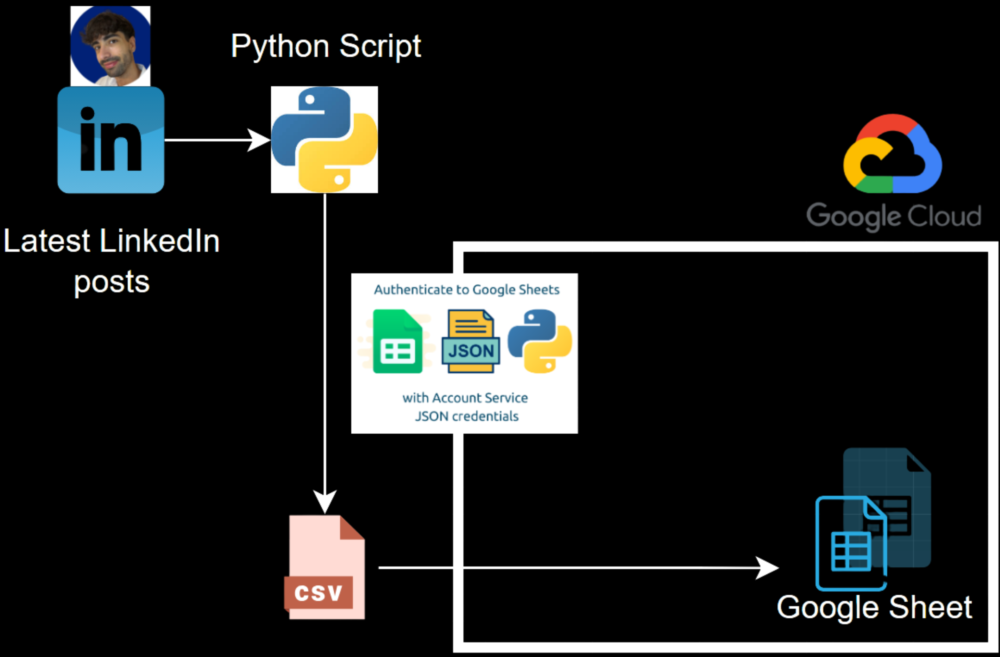
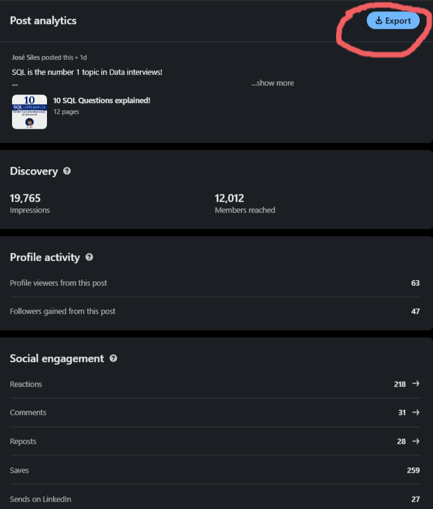
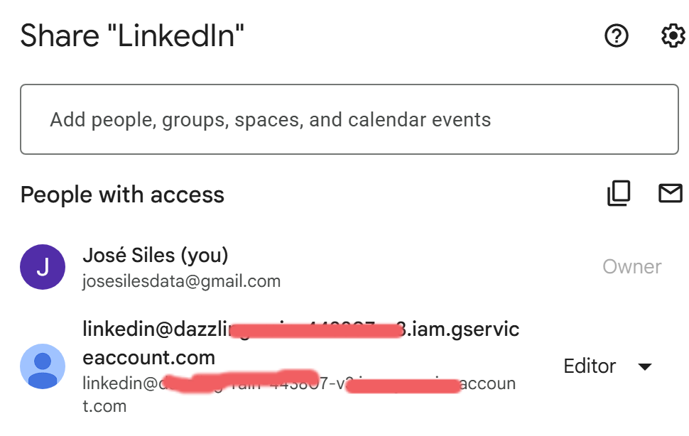
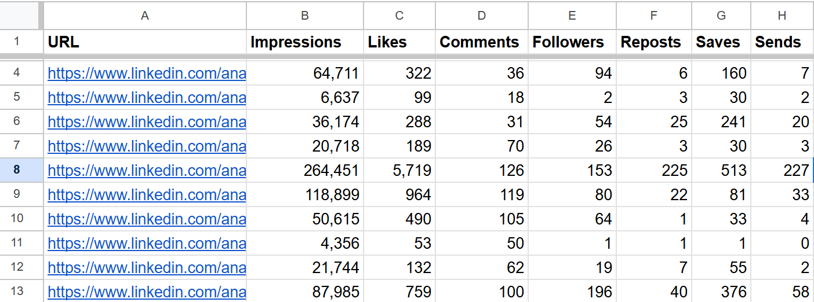

# LinkedIn Analytics Tracker



I built this project to track my latest 20 posts from LinkedIn in an automated way. Currently, LinkedIn allows you to export a post analytics:



But you have to go 1 by 1 and then format and copy paste into your notes.

Too much time!

With this solution I just press a button and it dumps all the analytics in a centralized table in Google Sheets for further analysis!

---

## Getting Started

### Clone the Repository
First, clone the repository to your local machine:

```bash
git clone https://github.com/JoseBlancoSiles/linkedin-analytics-tracker.git
cd linkedin-analytics-tracker
```
### Install Dependencies
Install the required Python packages:

```bash
pip install -r requirements.txt
```
### Configure the .env File
Create a .env file in the root directory of the project. This file is used to store sensitive environment variables. Add the following:

SELENIUM_PROFILE=C:\Users\HP\AppData\Local\Google\Chrome\SeleniumProfile Replace with your path.

LINKEDIN_USERNAME: Your LinkedIn username. For example, if your LinkedIn profile URL is https://www.linkedin.com/in/josesilesb/, your username is josesilesb.

SPREADSHEET_ID: The ID of your Google Sheet, which can be found in the URL of the sheet.


## Google Sheets Integration (Optional)
If you want to append the analytics data to a Google Sheet, follow these steps:

Create a Google Sheet

Open Google Sheets and create a new spreadsheet.
Add the following headers in the first row:

```bash
URL, Impressions, Likes, Comments, Followers, Reposts, Saves, Sends
```

Enable the Google Sheets API

Go to the Google Cloud Console.

Create a new project or select an existing one.

Enable the Google Sheets API for your project.

Create a Service Account:
Navigate to the "APIs & Services > Credentials" section.

Create a new service account.

Download the JSON key file for the service account.

Add the Service Account JSON Key

Place the downloaded JSON key file in the src/ folder.

Rename the file to service_account.json.

Share the Google Sheet with the Service Account

Open your Google Sheet.

Share it with the email address of your service account (found in the service_account.json file).



### CSV-Only Option
If you prefer not to use Google Sheets, you can disable the Google Sheets integration. To do this, comment out the call to the append_to_google_sheet function in the main.py file. The analytics data will still be saved to a CSV file in the data/ folder.

## Usage
Run the script:

```bash
python src/main.py
```

By default:

The analytics data will be saved to data/posts-analytics.csv.
If Google Sheets integration is enabled, the data will also be appended to the specified Google Sheet.

## Notes
Ensure the .env file is properly configured before running the script.
If using Google Sheets, make sure the service_account.json file is correctly placed and the API is enabled.
The script will create the data/ folder automatically if it doesn't already exist.

You will have something like this!



I hope this helps you to grow your LinkedIn profile!

## To Improve

In following coding sessions I plan to add:
- Automatically scrap the HOOK and the CTA
- Autogenerate KPIs columns like:
  - Followers/Impression
  - Likes/Impression
  
And even a formula to rank the top performant posts!
If you have any idea, please hit me up and contribute. 